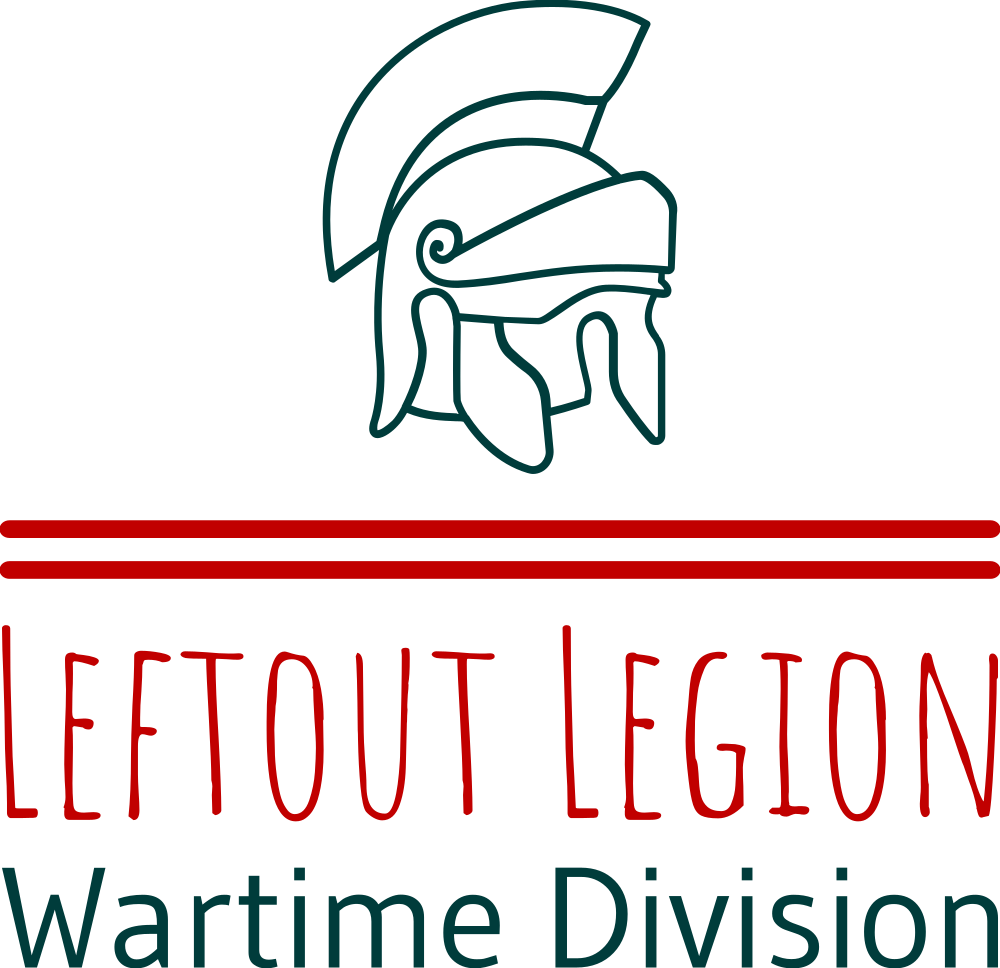

{ Left Out Legion } - > https://soundcloud.com/left-out-legion/

[ est. 2023 ] -- >  

[ WarTime Division ] - > 

@acid-apostle &lt; - > https://soundcloud.com/acid-apostle/


[ Homestead Division ] - > https://soundcloud.com/homestead-division/


---------------------------------------------------------------

```

 (                              )                    (                                       
 )\ )          (         )   ( /(              )     )\ )                                    
(()/(     (    )\ )   ( /(   )\())     (    ( /(    (()/(     (    (  (    (                 
 /(_))   ))\  (()/(   )\()) ((_)\     ))\   )\())    /(_))   ))\   )\))(   )\    (     (     
(_))    /((_)  /(_)) (_))/    ((_)   /((_) (_))/    (_))    /((_) ((_))\  ((_)   )\    )\ )  
| |    (_))   (_) _| | |_    / _ \  (_))(  | |_     | |    (_))    (()(_)  (_)  ((_)  _(_/(  
| |__  / -_)   |  _| |  _|  | (_) | | || | |  _|    | |__  / -_)  / _` |   | | / _ \ | ' \)) 
|____| \___|   |_|    \__|   \___/   \_,_|  \__|    |____| \___|  \__, |   |_| \___/ |_||_|  
                                                                  |___/                      
```

---------------------------------------------------------------------------


"It's difficult to determine definitively whether you are the first person to organize a music label on GitHub, as there are numerous projects and organizations hosted on GitHub covering various domains, including music. GitHub is a popular platform for version control and collaboration across different industries, including the music industry."

"While many record labels and music-related projects may not be publicly visible on GitHub due to the nature of their work or the use of private repositories, there are still examples of music-related projects and initiatives on GitHub. These can include open-source music software, music-related APIs, project management tools for musicians, and more."

"However, the specific combination of your record label project, its goals, and the organization structure you set up on GitHub could be unique to your initiative. Each record label has its own distinct vision, strategies, and implementation methods."

"Regardless of being the first or not, using GitHub for organizing your music label project can provide numerous benefits, such as version control, collaboration, and task management. It offers a convenient platform for sharing and collaborating on code, documentation, and other project-related materials."

"Remember that GitHub is a dynamic and constantly evolving platform, with new projects being created all the time. If you haven't found examples of music labels on GitHub, it doesn't diminish the value or uniqueness of your project. Embrace the opportunity to leverage GitHub's features to enhance the organization and management of your record label."

  --  chatGPT. 
